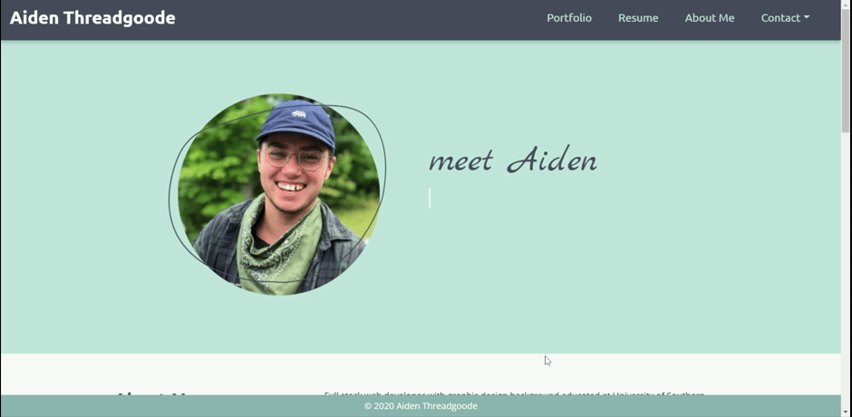

# Aiden Threadgoode: Portfolio

#### [My Responsive Portfolio](https://a-thread.github.io/Meet-Aiden/)

## Description
This is a portfolio website containing contact information, project examples, as well as a short bio. It is a mobile-first design featuring custom stylings and was a ton of fun to make!

---

### Table of Contents
- [Description](#description)
- [Technologies Used](#technologies)
- [Personalized Stylings](#personalized)
    - [Navigation](#nav)
    - [Portfolio](#portfolio)
    - [AnimateCSS & ScrollReveal](#animatecss)
- [License](#license)
- [Questions](#questions)

---

## Technologies Used
>- Bootstrap
>- jQuery
>- Font Awesome
>- Google Fonts
>- Animate.css
>- ScrollReveal.js
>- Coolors
>- Canva

## Personalized Stylings
I used Canva to create a personalized headshot to add a simple but elegant touch to the layout. Through Coolors, I was able to put together a unique and eye-catching color scheme to tie the whole site together

### *Navigation*
I used a responsive nav to make sure that this site would be mobile first.

### *Portfolio*

### *AnimateCSS and ScrollReveal* 
I used Animate CSS for the headers on my intro section in conjunction with Scroll Reveal to make my Intro section and Portfolio section more dynamic. 

### License 

This project is licensed under MIT.

### Questions

If you have any questions, feel free to [email me!](mailto:aiden.threadgoode@gmail.com)

*© 2020 Aiden Threadgoode*
