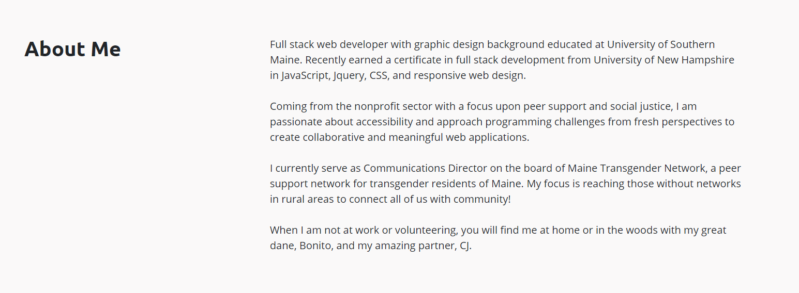

# Aiden Threadgoode: Portfolio

[My Responsive Portfolio](https://a-thread.github.io/Aiden-Threadgoode-Portfolio/)

## Description
This is a portfolio containing contact information, project examples, as well as a short bio. It is a mobile-first design featuring custom stylings and was a ton of fun to make!

### Technologies Used
- Bootstrap
- jQuery
- CSS
- Font Awesome
- Google Fonts
- Coolors
- Canva

## Personalized Stylings
I used Canva to create a personalized headshot to add a simple but elegant touch to the layout. Through Coolors, I was able to put together a unique and eye-catching color scheme to tie the whole site together

### Nav
I used a responsive nav to make sure that this site would be mobile first.

### Contact
I used a dropdown nav item to link to my Github, LinkedIn and Email

### Portfolio
In this build I got to play around with Bootstrap a lot more. Here, I created collapsable cards for each portfolio item

*If you like what you see here, contact [Aiden Threadgoode.](mailto:aiden.threadgoode@gmail.com)*